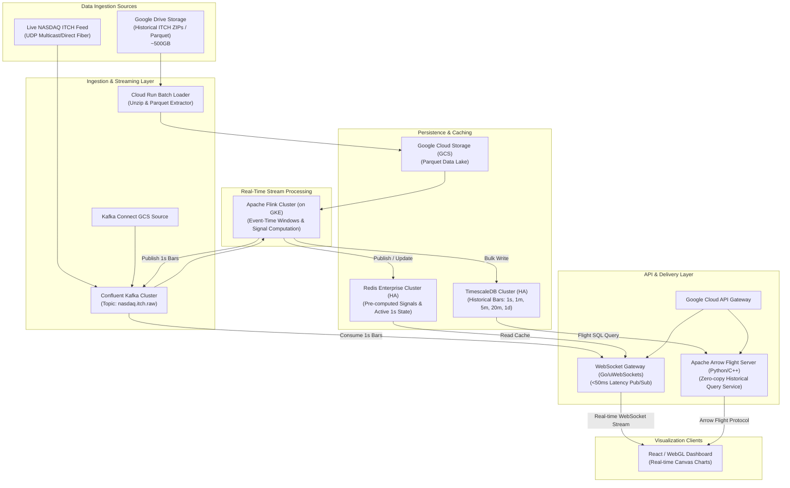
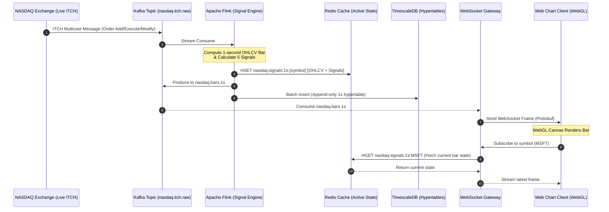

# Production Architecture Specification: NASDAQ Market Growth/Shrinkage Visualisation Platform

This document outlines the end-to-end production architecture for a high-performance, real-time NASDAQ market growth and shrinkage visualization platform. The system ingest historic and real-time NASDAQ TotalView ITCH data, computes quantitative signals across multiple timeframes, caches key states, and serves real-time updates and historical queries at scale.

---

## 1. System Architecture Diagram

Below is the complete system architecture diagram, showing ingestion, stream processing, storage, caching, and API layers.



---

## 2. Technology Stack Selection & Justifications

| Component | Selected Technology | Justification |
| :--- | :--- | :--- |
| **Message Broker** | **Apache Kafka (Confluent Cloud)** | Chosen for its high-throughput, partitioning model, and low-latency storage capabilities. ITCH streams generate up to 100,000 messages/sec during peak volatility; Kafka handles this effortlessly with structured partitioning by Ticker Symbol to maintain order within each security. |
| **Stream Processing** | **Apache Flink** | Provides native event-time processing, session windows, and robust state management. Necessary for calculating rolling Z-scores and volatility ratios across high-frequency 1-second streams with out-of-order tolerance. |
| **Time-Series DB** | **TimescaleDB (PostgreSQL)** | Combines the full relational power of PostgreSQL with hypertable optimizations for time-series. Ideal for handling raw 1-second OHLCV data while automatically calculating 1m, 5m, 20m, and daily bars using Continuous Aggregates. |
| **Cache Layer** | **Redis Enterprise** | Serves as an in-memory database to store pre-computed signals and the most active 1-second state. Delivers sub-millisecond read times to satisfy the WebSocket gateway's <50ms end-to-end latency budget. |
| **Historical Queries** | **Apache Arrow Flight** | Replaces standard REST/JSON for bulk historical downloads. Serves binary, columnar data directly to clients without serialization overhead. Yields 10x-100x speedups for multi-gigabyte pandas/WebGL data frames. |
| **WebSocket Server** | **Go (using uWebSockets or Gorilla)** | Go's lightweight goroutines and excellent concurrency primitives handle 10,000+ concurrent connections per node. uWebSockets bindings ensure minimal CPU/Memory overhead for high-frequency pub/sub. |
| **Container Orchestration** | **Google Kubernetes Engine (GKE)** | Used to run Flink JobManagers/TaskManagers, WebSocket instances, and Arrow Flight query nodes. Offers autoscaling, private networking, and simplified node management. |

---

## 3. Data Flow Diagram

The lifecycle of an ITCH message from creation on the exchange to visual update on the user's browser:



---

## 4. Signal Computation Definitions

### 1. Simple "Rising Tide"
This indicator signals strong upward momentum coupled with volume confirmation.
*   **Formula**:
    $$\text{RisingTide}_t = \begin{cases} 1 & \text{if } Close_t > Close_{t-N} \text{ AND } Volume_t > \mu_{Vol, N} \\ 0 & \text{otherwise} \end{cases}$$
    where $N$ is the window size (typically 20 bars) and $\mu_{Vol, N}$ is the rolling volume average:
    $$\mu_{Vol, N} = \frac{1}{N} \sum_{i=0}^{N-1} Volume_{t-i}$$

### 2. Momentum Z-Score
Measures how many standard deviations the current rolling log-return is from its historical mean.
*   **Formula**:
    $$R_t = \ln\left(\frac{Close_t}{Close_{t-1}}\right)$$
    $$\text{RollRet}_{t, K} = \sum_{i=0}^{K-1} R_{t-i} = \ln\left(\frac{Close_t}{Close_{t-K}}\right)$$
    $$\text{Momentum Z-Score}_t = \frac{\text{RollRet}_{t, K} - \mu_{R, 60D}}{\sigma_{R, 60D}}$$
    where $K$ is the current timeframe window (e.g. 60 bars), and $\mu_{R, 60D}$ and $\sigma_{R, 60D}$ are the daily log-return mean and standard deviation calculated over a rolling 60-day historical window.

### 3. Garman-Klass Volatility Regime
Determines whether volatility is expanding or contracting by comparing a short-term window to a long-term window using the Garman-Klass estimator.
*   **Formula** (Single Bar Garman-Klass):
    $$GK_t = 0.5 \left( \ln \frac{High_t}{Low_t} \right)^2 - (2\ln 2 - 1) \left( \ln \frac{Close_t}{Open_t} \right)^2$$
    *   **Rolling GK Volatility ($W$ days)**:
        $$\sigma_{GK, W} = \sqrt{\frac{1}{W} \sum_{i=0}^{W-1} GK_{t-i}}$$
    *   **Volatility Regime**:
        $$\text{RegimeRatio}_t = \frac{\sigma_{GK, 5}}{\sigma_{GK, 20}}$$
        *   $\text{RegimeRatio}_t > 1.2$ indicates a high-volatility regime.
        *   $\text{RegimeRatio}_t < 0.8$ indicates a low-volatility regime.

### 4. Order Flow Imbalance (OFI)
Quantifies net buying/selling pressure based on order book changes.
*   **Formula**:
    At any book update $i$ within bar $t$:
    $$f(i) = \Delta V_{Bid}(i) - \Delta V_{Ask}(i)$$
    where:
    $$\Delta V_{Bid}(i) = \begin{cases} Volume_{Bid, i} & \text{if } Price_{Bid, i} > Price_{Bid, i-1} \\ Volume_{Bid, i} - Volume_{Bid, i-1} & \text{if } Price_{Bid, i} = Price_{Bid, i-1} \\ 0 & \text{if } Price_{Bid, i} < Price_{Bid, i-1} \end{cases}$$
    $$\Delta V_{Ask}(i) = \begin{cases} Volume_{Ask, i} & \text{if } Price_{Ask, i} < Price_{Ask, i-1} \\ Volume_{Ask, i} - Volume_{Ask, i-1} & \text{if } Price_{Ask, i} = Price_{Ask, i-1} \\ 0 & \text{if } Price_{Ask, i} > Price_{Ask, i-1} \end{cases}$$
    $$\text{OFI}_t = \frac{\sum_{i \in t} f(i)}{\text{Total Trade Volume}_t}$$

### 5. Composite HMM State
A 5-state Hidden Markov Model classifies the market regime using the inputs: `[Momentum Z-Score, Volatility Regime, OFI]`.
*   **States**:
    *   `0`: Extreme Bearish (High Volatility, Negative Return)
    *   `1`: Low Volatility Bearish (Slow Shrinkage)
    *   `2`: Mean-Reverting (Range-bound)
    *   `3`: Low Volatility Bullish (Steady Growth)
    *   `4`: Extreme Bullish (High Volatility, Positive Return)
*   **Weighted Transition**:
    $$\text{State}_t = \operatorname{argmax}_S P(S_t = s \mid X_t, S_{t-1})$$
    where $X_t = [Z_t, \text{RegimeRatio}_t, \text{OFI}_t]^T$.

---

## 5. TimescaleDB Schema & Continuous Aggregates

The historical database is structured around an append-only `bars_1s` hypertable, with continuous aggregates handling scaling to larger resolutions.

```sql
-- Enable TimescaleDB extension
CREATE EXTENSION IF NOT EXISTS timescaledb CASCADE;

-- 1. Base Table (1-Second Bars + Computed Signals)
CREATE TABLE public.bars_1s (
    "time" TIMESTAMPTZ NOT NULL,
    symbol VARCHAR(12) NOT NULL,
    "open" NUMERIC(10, 4) NOT NULL,
    high NUMERIC(10, 4) NOT NULL,
    low NUMERIC(10, 4) NOT NULL,
    "close" NUMERIC(10, 4) NOT NULL,
    volume BIGINT NOT NULL,
    rising_tide BOOLEAN NOT NULL,
    momentum_z DOUBLE PRECISION NOT NULL,
    gk_vol DOUBLE PRECISION NOT NULL,
    ofi DOUBLE PRECISION NOT NULL,
    hmm_state SMALLINT NOT NULL,
    hmm_composite DOUBLE PRECISION NOT NULL
);

-- Convert to hypertable partitioned by time (1-day chunk interval)
SELECT create_hypertable('public.bars_1s', 'time', chunk_time_interval => INTERVAL '1 day');

-- Create composite index for efficient queries by symbol and time
CREATE INDEX idx_symbol_time ON public.bars_1s (symbol, "time" DESC);

-- Enable compression on the 1-second hypertable
ALTER TABLE public.bars_1s SET (
    timescaledb.compress,
    timescaledb.compress_segmentby = 'symbol',
    timescaledb.compress_orderby = 'time DESC'
);

-- Add compression policy (compress data older than 7 days)
SELECT add_compression_policy('public.bars_1s', INTERVAL '7 days');

-- 2. Continuous Aggregate: 1-Minute Bars
CREATE MATERIALIZED VIEW public.bars_1m
WITH (timescaledb.continuous) AS
SELECT 
    time_bucket('1 minute', "time") AS "time",
    symbol,
    first("open", "time") AS "open",
    max(high) AS high,
    min(low) AS low,
    last("close", "time") AS "close",
    sum(volume) AS volume,
    avg(momentum_z) AS avg_momentum_z,
    avg(gk_vol) AS avg_gk_vol,
    avg(ofi) AS avg_ofi,
    mode() WITHIN GROUP (ORDER BY hmm_state) AS mode_hmm_state
FROM public.bars_1s
GROUP BY time_bucket('1 minute', "time"), symbol;

-- 3. Continuous Aggregate: 5-Minute Bars
CREATE MATERIALIZED VIEW public.bars_5m
WITH (timescaledb.continuous) AS
SELECT 
    time_bucket('5 minutes', "time") AS "time",
    symbol,
    first("open", "time") AS "open",
    max(high) AS high,
    min(low) AS low,
    last("close", "time") AS "close",
    sum(volume) AS volume,
    avg(momentum_z) AS avg_momentum_z,
    avg(gk_vol) AS avg_gk_vol,
    avg(ofi) AS avg_ofi,
    mode() WITHIN GROUP (ORDER BY hmm_state) AS mode_hmm_state
FROM public.bars_1s
GROUP BY time_bucket('5 minutes', "time"), symbol;

-- 4. Continuous Aggregate: 20-Minute Bars
CREATE MATERIALIZED VIEW public.bars_20m
WITH (timescaledb.continuous) AS
SELECT 
    time_bucket('20 minutes', "time") AS "time",
    symbol,
    first("open", "time") AS "open",
    max(high) AS high,
    min(low) AS low,
    last("close", "time") AS "close",
    sum(volume) AS volume,
    avg(momentum_z) AS avg_momentum_z,
    avg(gk_vol) AS avg_gk_vol,
    avg(ofi) AS avg_ofi,
    mode() WITHIN GROUP (ORDER BY hmm_state) AS mode_hmm_state
FROM public.bars_1s
GROUP BY time_bucket('20 minutes', "time"), symbol;

-- 5. Continuous Aggregate: Daily Bars
CREATE MATERIALIZED VIEW public.bars_1d
WITH (timescaledb.continuous) AS
SELECT 
    time_bucket('1 day', "time") AS "time",
    symbol,
    first("open", "time") AS "open",
    max(high) AS high,
    min(low) AS low,
    last("close", "time") AS "close",
    sum(volume) AS volume,
    avg(momentum_z) AS avg_momentum_z,
    avg(gk_vol) AS avg_gk_vol,
    avg(ofi) AS avg_ofi,
    mode() WITHIN GROUP (ORDER BY hmm_state) AS mode_hmm_state
FROM public.bars_1s
GROUP BY time_bucket('1 day', "time"), symbol;

-- Add Refresh Policies for Continuous Aggregates
SELECT add_continuous_aggregate_policy('public.bars_1m',
    start_offset => INTERVAL '3 minutes',
    end_offset => INTERVAL '1 minute',
    schedule_interval => INTERVAL '1 minute');

SELECT add_continuous_aggregate_policy('public.bars_5m',
    start_offset => INTERVAL '15 minutes',
    end_offset => INTERVAL '5 minutes',
    schedule_interval => INTERVAL '5 minutes');

SELECT add_continuous_aggregate_policy('public.bars_20m',
    start_offset => INTERVAL '60 minutes',
    end_offset => INTERVAL '20 minutes',
    schedule_interval => INTERVAL '20 minutes');

SELECT add_continuous_aggregate_policy('public.bars_1d',
    start_offset => INTERVAL '3 days',
    end_offset => INTERVAL '1 hour',
    schedule_interval => INTERVAL '1 hour');
```

---

## 6. Kafka Topic Structure & Avro Schemas

We define two primary topics. `nasdaq.itch.raw` handles the source feed, and `nasdaq.bars.1s` acts as the low-latency channel for downstream consumers (WebSockets/TimescaleDB).

### Topic Structure
*   **`nasdaq.itch.raw`**: 12 partitions. Keyed by `symbol` (e.g. `AAPL`). Partitioning ensures that all order events for a given ticker arrive in sequence at a single Flink worker. Retains data for 24 hours.
*   **`nasdaq.bars.1s`**: 12 partitions. Keyed by `symbol`. Contains 1-second aggregates and signals. Retains data for 3 days.

### Avro Schema for `nasdaq.bars.1s`
```json
{
  "type": "record",
  "name": "Bar1s",
  "namespace": "com.nasdaq.growth.schema",
  "doc": "Aggregated 1-second bar and computed quantitative signals.",
  "fields": [
    { "name": "time", "type": "long", "doc": "Epoch millisecond timestamp of the bar" },
    { "name": "symbol", "type": "string", "doc": "Ticker symbol" },
    { "name": "open", "type": "double", "doc": "Bar open price" },
    { "name": "high", "type": "double", "doc": "Bar high price" },
    { "name": "low", "type": "double", "doc": "Bar low price" },
    { "name": "close", "type": "double", "doc": "Bar close price" },
    { "name": "volume", "type": "long", "doc": "Bar traded volume" },
    { "name": "rising_tide", "type": "boolean", "doc": "Rising tide signal state" },
    { "name": "momentum_z", "type": "double", "doc": "Momentum z-score normalized by 60D std" },
    { "name": "gk_vol", "type": "double", "doc": "Garman-Klass volatility regime ratio (5D/20D)" },
    { "name": "ofi", "type": "double", "doc": "Normalized Order Flow Imbalance" },
    { "name": "hmm_state", "type": "int", "doc": "HMM State classification (0-4)" },
    { "name": "hmm_composite", "type": "double", "doc": "HMM composite value score" }
  ]
}
```

---

## 7. API Endpoint Specifications (OpenAPI 3.0)

For large historical time-series datasets, the platform returns Arrow Flight endpoints instead of large JSON payloads.

```yaml
openapi: 3.0.3
info:
  title: NASDAQ Growth/Shrinkage Query Service
  version: 1.0.0
  description: High-performance API for historical queries and cached state retrievals.
paths:
  /api/v1/historical/flight:
    post:
      summary: Retrieve Ticket to Apache Arrow Flight stream
      description: Returns a FlightInfo ticket to fetch raw/aggregated historical data via the gRPC-based Arrow Flight endpoint.
      operationId: getHistoricalFlightTicket
      requestBody:
        required: true
        content:
          application/json:
            schema:
              type: object
              properties:
                symbols:
                  type: array
                  items:
                    type: string
                  example: ["AAPL", "MSFT"]
                resolution:
                  type: string
                  enum: ["1s", "1m", "5m", "20m", "1d"]
                  example: "1m"
                startTime:
                  type: string
                  format: date-time
                  example: "2026-05-01T00:00:00Z"
                endTime:
                  type: string
                  format: date-time
                  example: "2026-05-15T00:00:00Z"
      responses:
        '200':
          description: Flight Ticket generated successfully. Use this ticket against the Flight endpoint on port 8443.
          content:
            application/json:
              schema:
                type: object
                properties:
                  flight_endpoint:
                    type: string
                    example: "flight.nasdaq-growth.internal:8443"
                  ticket_bytes:
                    type: string
                    format: byte
                    description: Base64 encoded ticket descriptor.
        '400':
          description: Invalid request parameters.

  /api/v1/signals/latest:
    get:
      summary: Get latest computed signals
      description: Returns the latest cached signal status for specified symbols from Redis.
      operationId: getLatestSignals
      parameters:
        - name: symbols
          in: query
          required: true
          schema:
            type: string
            description: Comma-separated list of ticker symbols.
            example: "AAPL,MSFT,GOOG"
      responses:
        '200':
          description: Latest signals retrieved successfully.
          content:
            application/json:
              schema:
                type: object
                additionalProperties:
                  $ref: '#/components/schemas/SignalState'
components:
  schemas:
    SignalState:
      type: object
      properties:
        time:
          type: string
          format: date-time
        symbol:
          type: string
        close:
          type: number
        volume:
          type: integer
        signals:
          type: object
          properties:
            rising_tide:
              type: boolean
            momentum_z:
              type: number
            gk_vol:
              type: number
            ofi:
              type: number
            hmm_state:
              type: integer
```

---

## 8. WebSocket Message Protocol Specification

To minimize bandwidth and latency, the real-time stream runs on binary Protobuf over WebSockets. Text-based JSON is supported as a fallback.

### Protobuf Message Specification (`market_stream.proto`)
```protobuf
syntax = "proto3";
package nasdaq.growth.stream;

enum HmmState {
  STATE_EXTREME_BEARISH = 0;
  STATE_LOW_VOL_BEARISH = 1;
  STATE_MEAN_REVERTING = 2;
  STATE_LOW_VOL_BULLISH = 3;
  STATE_EXTREME_BULLISH = 4;
}

message ClientSubscription {
  enum Action {
    SUBSCRIBE = 0;
    UNSUBSCRIBE = 1;
  }
  Action action = 1;
  repeated string symbols = 2;
  string resolution = 3; // "1s", "1m", "5m", "20m", "1d"
}

message BarUpdateFrame {
  int64 timestamp = 1;      // Epoch ms
  string symbol = 2;         // e.g. "AAPL"
  double open = 3;
  double high = 4;
  double low = 5;
  double close = 6;
  int64 volume = 7;
  
  bool signal_rising_tide = 8;
  double signal_momentum_z = 9;
  double signal_gk_vol = 10;
  double signal_ofi = 11;
  HmmState signal_hmm_state = 12;
  double signal_hmm_composite = 13;
}
```

### Protocol Interactions
1.  **Connection**: Client connects to `wss://stream.nasdaq-growth.com/ws/v1`.
2.  **Handshake**: Server sends server time frame.
3.  **Subscription**: Client sends binary `ClientSubscription` message.
4.  **Data Transmission**: Server streams binary `BarUpdateFrame` updates every second for active subscriptions.
5.  **Heartbeat**: Client must ping every 30 seconds to prevent timeout. Server responds with Pong.

---

## 9. Caching Strategy & Redis Schema

Redis serves as the low-latency serving layer for active clients. Signals and OHLCV states are pre-computed in Flink or retrieved from TimescaleDB and cached.

### Redis Key Structure
*   **Latest Bar Metadata (String Hash)**: 
    *   Key: `nasdaq:active:bar:{symbol}:{resolution}`
    *   Value: `Hash { open, high, low, close, volume, timestamp }`
*   **Latest Computed Signals (String Hash)**:
    *   Key: `nasdaq:active:signals:{symbol}:{resolution}`
    *   Value: `Hash { rising_tide, momentum_z, gk_vol, ofi, hmm_state }`
*   **Recent History (Sorted Set)**: 
    *   Key: `nasdaq:history:{symbol}:{resolution}`
    *   Score: Timestamp (epoch seconds)
    *   Value: Serialized Protobuf frame

### TTL Recommendations
| Resolution | Cache Window | Recommended TTL | Rationale |
| :--- | :--- | :--- | :--- |
| **1-Second** | Last 5 minutes | **10 minutes** | Fast rotation. Keeps Redis memory footprint low. |
| **1-Minute** | Last 2 hours | **4 hours** | Accommodates short intraday reload queries. |
| **5-Minute** | Last 12 hours | **24 hours** | Covers a full trading day + pre/post-market. |
| **20-Minute** | Last 48 hours | **3 days** | Spans over weekends. |
| **Daily** | Last 60 days | **7 days** | Supports the 60-day standard deviation calculations. |

---

## 10. Deployment Topology on Google Cloud (GCP)

```mermaid
graph TD
    %% Internet Edge
    ClientBrowser[User Browser] -->|HTTPS/WSS| CloudArmor[Google Cloud Armor (WAF/DDoS Protection)]
    CloudArmor --> GLB[Google Cloud Load Balancer]

    %% Internal Networking (VPC)
    subgraph VPC ["Custom VPC (10.0.0.0/16)"]
        %% Public Subnet
        subgraph Public_Subnet ["Public Frontends (10.0.1.0/24)"]
            GLB -->|Route traffic| CloudRun[Cloud Run - API Gateways]
            GLB -->|WSS connections| GKE_WS[GKE Pods: WebSocket Servers]
        end

        %% Private Subnet (Processing & Storage)
        subgraph Private_Subnet ["Private Processing & Database (10.0.2.0/20)"]
            %% GKE Processing
            GKE_Flink[GKE Pods: Flink TaskManagers]
            GKE_Flight[GKE Pods: Arrow Flight Services]
            
            %% Managed Databases & Caches
            RedisCluster[Memorystore for Redis - HA Enterprise]
            TimescaleDB[Self-hosted TimescaleDB Cluster on StatefulSets]
        end
    end

    %% Internal Routing
    CloudRun -->|gRPC / Internal Link| GKE_Flight
    GKE_WS -->|HGET| RedisCluster
    GKE_WS -->|Subscribe| GKE_Flink
    GKE_Flink -->|HSET| RedisCluster
    GKE_Flink -->|Write| TimescaleDB
    GKE_Flight -->|SQL Select| TimescaleDB

    %% External Services connected privately
    GCS_Bucket[Google Cloud Storage - Cold Bucket]
    TimescaleDB -->|Backup to GCS| GCS_Bucket
    GKE_Flink -->|Checkpoints| GCS_Bucket
```

### Networking & Security details:
*   **VPC Peering**: Cloud SQL / Memorystore are allocated private IP blocks and accessible via Private Services Access.
*   **Cloud Armor**: Blocks SQL injection, rate-limits WebSocket connection requests, and mitigates DDoS threats.
*   **IAM Service Accounts**: Least-privilege roles map to Flink pods to allow read-only access to historical Parquet buckets on GCS.

---

## 11. Estimated Infrastructure Cost (10,000 DAU)

This model assumes **10,000 Daily Active Users (DAU)**, with a peak concurrent connection rate of **1,500 active users** streaming real-time 1-second price bars (watching an average of 50 tickers concurrently).

### 1. Compute & Stream Processing
*   **GKE Cluster (WebSocket Gateways & Flink Jobs)**:
    *   3x `e2-standard-4` nodes (4 vCPUs, 16 GB RAM) - 24/7.
    *   *Cost: ~$300 / month.*
*   **Cloud Run (Stateless REST API Gateways & OAuth)**:
    *   Dynamically scales from 0 to 15 instances.
    *   *Cost: ~$50 / month.*

### 2. Databases & Caching
*   **TimescaleDB (Multi-AZ Deployment)**:
    *   Self-hosted on GKE StatefulSets (SSD storage: 1 TB).
    *   *Cost: ~$450 / month.*
*   **Memorystore for Redis Enterprise (HA, 20 GB Capacity)**:
    *   Guarantees fast retrieval of active signals.
    *   *Cost: ~$180 / month.*
*   **Confluent Cloud Managed Kafka (Basic Tier)**:
    *   Covers ingestion of raw ITCH and internal 1s bar dissemination.
    *   *Cost: ~$250 / month.*

### 3. Storage & Backups
*   **Google Cloud Storage (GCS)**:
    *   500 GB raw archive + Parquet files + Flink Savepoints.
    *   *Cost: ~$15 / month.*

### 4. Networking & Egress (Primary Cost Variable)
*   **WebSocket Egress**:
    *   1,500 concurrent connections.
    *   Each connection streams 50 symbols. 50 updates/sec * 200 bytes per frame = 10 KB/sec.
    *   1,500 users * 10 KB/sec = 15 MB/sec.
    *   Assume 4 hours of daily market watching: 15 MB/s * 14,400s = 216 GB/day.
    *   Monthly Egress: 216 GB * 30 days = 6,480 GB (6.48 TB).
    *   *Egress cost (GCP Internet Egress ~$0.08 per GB): ~$520 / month.*
*   **Load Balancing & Cloud Armor**:
    *   Rule sets + ingress data processing.
    *   *Cost: ~$100 / month.*

### Total Monthly Cost Summary
| Component Category | Estimated Monthly Cost (USD) |
| :--- | :--- |
| Compute (GKE, Cloud Run) | $350 |
| Managed Storage & Databases | $895 |
| Managed Kafka Service | $250 |
| Networking & Egress | $620 |
| **Total Estimated Spend** | **$2,115 / month** |

---
*Technical Specification End. Prepared by Senior Systems Architect.*
